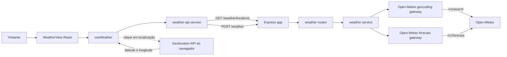

# Especificação técnica

## Resumo

A solução adiciona busca de localidades e consulta meteorológica ao backend Express existente, e substitui a tela de template do frontend por um painel React. O fluxo usa duas chamadas ao backend: uma para buscar localidades por nome e outra para consultar o clima pelas coordenadas da localidade selecionada. A chamada de clima também aceita coordenadas do navegador; nesse fluxo a tela usa o rótulo “Sua localização”, sem adicionar um serviço de geocodificação reversa.

A integração externa ficará isolada em gateways do backend, com timeout, validação e conversão para contratos próprios da aplicação. O frontend manterá estado de busca e renderização em hooks e services. Não haverá persistência nem chave de API para a Open-Meteo. Vitest será introduzido para unit e integração, com cobertura mínima de 80% conforme as rules do repositório.

## Arquitetura do sistema

### Visão dos componentes



Componentes novos ou modificados:

- `frontend/src/App.tsx` (modificado): passa a renderizar a view do clima. Remove a checagem periódica de `/health` e o conteúdo “template”; `/health` permanece disponível no backend.
- `frontend/src/views/WeatherView.tsx` (novo): compõe busca, seleção de localidade, clima atual, previsão, estados e atribuição. Não concentra chamadas HTTP nem formatação de domínio.
- `frontend/src/components/weather/WeatherSearchForm.tsx` (novo): campo rotulado, botão de busca e submissão por Enter.
- `frontend/src/components/weather/WeatherLocationResults.tsx` (novo): lista acessível das localidades retornadas, identificadas por nome, região e país.
- `frontend/src/components/weather/WeatherLocationButton.tsx` (novo): ação explícita para solicitar a localização do navegador.
- `frontend/src/components/weather/CurrentWeatherCard.tsx` (novo): exibe cidade ou “Sua localização”, condições atuais, unidades e horário local.
- `frontend/src/components/weather/DailyForecast.tsx` (novo): exibe sete datas locais com condição e temperaturas mínima e máxima.
- `frontend/src/components/weather/WeatherFeedback.tsx` (novo): estados de carregamento, vazio, validação, erro e localização negada; usa mensagens acessíveis.
- `frontend/src/components/weather/WeatherAttribution.tsx` (novo): exibe crédito para Open-Meteo e GeoNames com links às fontes.
- `frontend/src/hooks/use-weather.ts` (novo): coordena busca, seleção, consulta, carregamento e erros; evita aplicar resposta obsoleta após uma busca mais recente.
- `frontend/src/hooks/use-browser-location.ts` (novo): encapsula `navigator.geolocation`; só solicita permissão quando a ação do usuário o invoca.
- `frontend/src/services/weather-api.ts` (novo): único cliente frontend para `/weather/locations` e `/weather`; valida status HTTP e traduz códigos de erro para mensagens PT-BR.
- `frontend/src/lib/weather-codes.ts` e `frontend/src/lib/weather-dates.ts` (novos): convertem códigos WMO para rótulos em português e formatam datas/horas sem deslocar o fuso da localidade.
- `frontend/src/types/weather.ts` (novo): tipos dos contratos HTTP consumidos pela interface.
- `frontend/vite.config.ts`, `frontend/package.json` e `frontend/package-lock.json` (modificados): configuração de testes, script e dependências de teste; a configuração também lê `VITE_API_BASE_URL` como endereço público do backend.
- `backend/src/index.ts` (modificado): carrega ambiente e inicia o servidor; deixa de concentrar a criação da aplicação Express.
- `backend/src/app.ts` (novo): cria a aplicação Express, registra middleware e rotas e permite injetar dependências para os testes.
- `backend/src/routes/weather-routes.ts` (novo): valida entrada HTTP, chama o serviço meteorológico e serializa status e contratos.
- `backend/src/services/weather-service.ts` (novo): orquestra busca e previsão, sem depender de `Request` ou `Response`.
- `backend/src/gateway/open-meteo-geocoding-gateway.ts` e `backend/src/gateway/open-meteo-weather-gateway.ts` (novos): isolam URLs, parâmetros, timeout, validação do formato externo e normalização dos dados.
- `backend/src/middleware/error-handler.ts` e `backend/src/types/weather.ts` (novos): convertem falhas em envelope estável e definem os contratos do backend.
- `backend/package.json`, `backend/package-lock.json` e `backend/vitest.config.ts` (modificados/novos): script e dependências/configuração de testes.

O fluxo de cidade é: digitar e enviar consulta → receber até dez correspondências → selecionar uma se houver mais de uma → enviar latitude e longitude ao backend → mostrar clima atual e previsão. Se houver somente uma correspondência, a interface pode selecioná-la automaticamente. O fluxo de localização do navegador começa exclusivamente pelo clique do usuário e segue diretamente para a consulta por coordenadas.

## Design de implementação

### Principais interfaces

Os serviços permanecem independentes do Express e do React. As assinaturas abaixo são contratos de responsabilidade, não uma implementação completa.

```text
WeatherGateway
  searchLocations(query: string) -> Promise<WeatherLocation[]>
  getForecast(input: Coordinates) -> Promise<WeatherForecast>

WeatherService
  searchLocations(query: string) -> Promise<WeatherLocation[]>
  getForecast(input: Coordinates) -> Promise<WeatherForecast>

WeatherApi (frontend)
  searchLocations(query: string, signal?: AbortSignal) -> Promise<WeatherLocation[]>
  getForecast(input: Coordinates, signal?: AbortSignal) -> Promise<WeatherForecast>
```

`createApp` recebe o serviço meteorológico como dependência substituível. As rotas usam handlers `async`; Express 5 encaminha rejeições ao middleware de erro, conforme a [documentação de tratamento de erros do Express 5](https://expressjs.com/en/guide/error-handling/). O gateway usa `fetch` nativo do Node 22, versão disponível no ambiente explorado; não é necessária biblioteca HTTP adicional. Fixar Node `>=22` em `backend/package.json`, pois o repositório ainda não declara a versão do runtime. A API nativa está documentada em [Node.js Globals](https://nodejs.org/api/globals.html#fetch).

### Modelos de dados

Os contratos TypeScript serão mantidos em `frontend/src/types/weather.ts` e `backend/src/types/weather.ts`. Como os projetos são independentes e não há pacote compartilhado, os dois lados reproduzem os contratos documentados aqui; testes de integração protegem o formato público.

#### `WeatherLocation` — localidade selecionável

| Campo | Tipo | Obrigatório | Descrição |
| --- | --- | --- | --- |
| `id` | `number` | sim | Identificador da localidade na geocodificação. |
| `name` | `string` | sim | Nome da cidade/localidade, traduzido quando disponível. |
| `region` | `string \| null` | sim | Região administrativa; pode não existir na origem. |
| `country` | `string \| null` | sim | País para distinguir homônimos. |
| `countryCode` | `string \| null` | sim | Código ISO do país, quando fornecido. |
| `latitude` | `number` | sim | Latitude WGS84 usada na consulta do clima. |
| `longitude` | `number` | sim | Longitude WGS84 usada na consulta do clima. |
| `timezone` | `string \| null` | sim | Fuso horário IANA, quando fornecido pela geocodificação. |

```text
{
  "id": 3448439,
  "name": "São Paulo",
  "region": "São Paulo",
  "country": "Brasil",
  "countryCode": "BR",
  "latitude": -23.5475,
  "longitude": -46.6361,
  "timezone": "America/Sao_Paulo"
}
```

#### `WeatherForecast` — condições atuais e previsão diária

| Campo | Tipo | Obrigatório | Descrição |
| --- | --- | --- | --- |
| `timezone` | `string` | sim | Fuso IANA usado para os horários e datas da resposta. |
| `current.time` | `string` | sim | Horário local em ISO 8601 conforme o fuso da resposta. |
| `current.temperatureC` | `number \| null` | sim | Temperatura atual em °C. |
| `current.apparentTemperatureC` | `number \| null` | sim | Sensação térmica em °C. |
| `current.relativeHumidityPercent` | `number \| null` | sim | Umidade relativa em porcentagem. |
| `current.windSpeedKmh` | `number \| null` | sim | Velocidade do vento em km/h. |
| `current.weatherCode` | `number \| null` | sim | Código meteorológico WMO, convertido pela interface para descrição PT-BR. |
| `daily` | `WeatherDay[7]` | sim | Hoje e os seis dias seguintes, na data local. |
| `daily[].date` | `string` | sim | Data local no formato `YYYY-MM-DD`. |
| `daily[].weatherCode` | `number \| null` | sim | Código WMO da condição mais severa do dia. |
| `daily[].minimumTemperatureC` | `number \| null` | sim | Temperatura mínima diária em °C. |
| `daily[].maximumTemperatureC` | `number \| null` | sim | Temperatura máxima diária em °C. |

```text
{
  "timezone": "America/Sao_Paulo",
  "current": {
    "time": "2026-09-29T13:00",
    "temperatureC": 23.4,
    "apparentTemperatureC": 24.1,
    "relativeHumidityPercent": 54,
    "windSpeedKmh": 13.2,
    "weatherCode": 2
  },
  "daily": [
    { "date": "2026-09-29", "weatherCode": 1, "minimumTemperatureC": 17.2, "maximumTemperatureC": 24.0 },
    { "date": "2026-09-30", "weatherCode": 3, "minimumTemperatureC": 18.0, "maximumTemperatureC": 25.1 },
    { "date": "2026-10-01", "weatherCode": 61, "minimumTemperatureC": 18.4, "maximumTemperatureC": 23.0 },
    { "date": "2026-10-02", "weatherCode": 2, "minimumTemperatureC": 17.8, "maximumTemperatureC": 24.3 },
    { "date": "2026-10-03", "weatherCode": 0, "minimumTemperatureC": 17.1, "maximumTemperatureC": 26.0 },
    { "date": "2026-10-04", "weatherCode": 3, "minimumTemperatureC": 18.2, "maximumTemperatureC": 25.7 },
    { "date": "2026-10-05", "weatherCode": 61, "minimumTemperatureC": 18.7, "maximumTemperatureC": 22.9 }
  ]
}
```

> **Campos ausentes ou parciais na origem:** campos numéricos não disponíveis são normalizados para `null`; a interface mostra “Indisponível” para esse dado. Ausência de `current`, de datas diárias ou de uma resposta com sete datas é considerada resposta inválida da origem e resulta em erro 502, porque não satisfaz o contrato do PRD.

> **Fuso horário:** `current.time` e `daily[].date` já representam a hora/data local retornada pela API. A interface não deve reinterpretar `current.time` como o fuso do navegador nem deslocar datas diárias ao formatá-las. Ela usa `timezone` ao apresentar o horário e mantém a data local do contrato.

#### `Coordinates` — entrada de consulta meteorológica

| Campo | Tipo | Obrigatório | Descrição |
| --- | --- | --- | --- |
| `latitude` | `number` | sim | Valor finito entre -90 e 90. |
| `longitude` | `number` | sim | Valor finito entre -180 e 180. |

```text
{
  "latitude": -23.5475,
  "longitude": -46.6361
}
```

#### `WeatherApiError` — envelope de erro público

| Código | HTTP | Significado |
| --- | --- | --- |
| `INVALID_QUERY` | 400 | Busca ausente, curta demais ou acima do limite. |
| `INVALID_COORDINATES` | 400 | Latitude/longitude ausentes, não numéricas ou fora do intervalo. |
| `WEATHER_SOURCE_ERROR` | 502 | Erro HTTP, JSON inválido ou contrato inesperado da Open-Meteo. |
| `WEATHER_SOURCE_TIMEOUT` | 504 | A chamada externa excedeu o timeout. |

```text
{
  "error": {
    "code": "WEATHER_SOURCE_TIMEOUT",
    "message": "The weather provider did not respond in time."
  }
}
```

O backend não repassa mensagens ou corpos de erro brutos do provedor. O frontend traduz `code` para mensagens em português, mantendo detalhes técnicos e conteúdo externo fora da interface.

#### Mapeamento Open-Meteo → contratos da aplicação

| Origem | Destino |
| --- | --- |
| `results[].id` | `WeatherLocation.id` |
| `results[].name` | `WeatherLocation.name` |
| `results[].admin1` | `WeatherLocation.region` |
| `results[].country` | `WeatherLocation.country` |
| `results[].country_code` | `WeatherLocation.countryCode` |
| `results[].latitude`, `results[].longitude` | `WeatherLocation.latitude`, `WeatherLocation.longitude` |
| `results[].timezone` | `WeatherLocation.timezone` |
| `current.time` | `WeatherForecast.current.time` |
| `current.temperature_2m` | `WeatherForecast.current.temperatureC` |
| `current.apparent_temperature` | `WeatherForecast.current.apparentTemperatureC` |
| `current.relative_humidity_2m` | `WeatherForecast.current.relativeHumidityPercent` |
| `current.wind_speed_10m` | `WeatherForecast.current.windSpeedKmh` |
| `current.weather_code` | `WeatherForecast.current.weatherCode` |
| índices correspondentes de `daily.time`, `daily.weather_code`, `daily.temperature_2m_min`, `daily.temperature_2m_max` | `WeatherForecast.daily[].date`, `weatherCode`, `minimumTemperatureC`, `maximumTemperatureC` |

#### Parâmetros fixos na origem

| API | Parâmetros principais |
| --- | --- |
| Geocoding `/v1/search` | `name=<consulta>`, `count=10`, `language=pt`, `format=json` |
| Forecast `/v1/forecast` | `latitude`, `longitude`, `current=temperature_2m,apparent_temperature,relative_humidity_2m,wind_speed_10m,weather_code`, `daily=weather_code,temperature_2m_min,temperature_2m_max`, `forecast_days=7`, `timezone=auto`, `temperature_unit=celsius`, `wind_speed_unit=kmh`, `timeformat=iso8601` |

Os parâmetros e variáveis seguem a [documentação da Geocoding API](https://open-meteo.com/en/docs/geocoding-api) e da [Weather Forecast API](https://open-meteo.com/en/docs). A Geocoding API devolve coordenadas, fuso e dados administrativos; a Weather Forecast API aceita coordenadas e variáveis atuais/diárias e exige fuso quando se pedem variáveis diárias. Os códigos do tempo são WMO; a interface mantém uma tabela de rótulos PT-BR a partir da tabela oficial publicada na documentação.

### Endpoints da API

#### Visão geral

| Método | Rota | Descrição |
| --- | --- | --- |
| `GET` | `/weather/locations?query=...` | Busca localidades para permitir desambiguação. |
| `POST` | `/weather` | Consulta clima e previsão por coordenadas. |
| `GET` | `/health` | Endpoint existente, preservado para estado da API. |

---

#### `GET /weather/locations`

Busca até dez localidades. A interface seleciona uma correspondência ou apresenta as opções para desambiguação.

**Parâmetros de consulta**

| Parâmetro | Tipo | Padrão | Regras |
| --- | --- | --- | --- |
| `query` | `string` | — | Obrigatório; aparar espaços, mínimo de 2 e máximo de 100 caracteres. Aceita acentos e qualificadores como cidade, região e país. |

**Respostas**

| Status | Corpo | Quando |
| --- | --- | --- |
| `200` | `{ "locations": WeatherLocation[] }` | Busca válida; array vazio representa nenhuma correspondência. |
| `400` | `WeatherApiError` | Consulta ausente, menor que 2 ou maior que 100 caracteres. |
| `502` | `WeatherApiError` | Falha, resposta malformada ou JSON inválido da Geocoding API. |
| `504` | `WeatherApiError` | Timeout da Geocoding API. |

**Exemplo — sucesso**

```http
GET /weather/locations?query=S%C3%A3o%20Paulo
```

```text
{
  "locations": [
    {
      "id": 3448439,
      "name": "São Paulo",
      "region": "São Paulo",
      "country": "Brasil",
      "countryCode": "BR",
      "latitude": -23.5475,
      "longitude": -46.6361,
      "timezone": "America/Sao_Paulo"
    }
  ]
}
```

**Exemplo — nenhuma localidade encontrada**

```http
GET /weather/locations?query=Zzqville
```

```text
{
  "locations": []
}
```

**Exemplo — validação**

```http
GET /weather/locations?query=S
```

```text
{
  "error": {
    "code": "INVALID_QUERY",
    "message": "The query must contain between 2 and 100 characters."
  }
}
```

**Exemplo — erro da origem**

```http
GET /weather/locations?query=S%C3%A3o%20Paulo
```

```text
{
  "error": {
    "code": "WEATHER_SOURCE_ERROR",
    "message": "Location search is temporarily unavailable."
  }
}
```

> O backend monta a URL externa com `URLSearchParams`; texto do usuário nunca é interpolado diretamente em uma URL. A API externa recebe `count=10` e `language=pt`; resultados ausentes são normalizados como `locations: []`.

---

#### `POST /weather`

Obtém o clima para uma localidade selecionada ou coordenadas obtidas pelo navegador. A rota não persiste nem registra as coordenadas. `POST` é usado para manter coordenadas precisas fora da URL e dos logs de acesso baseados em URL; a operação não tem efeito colateral e a mesma entrada produz uma nova leitura do provedor.

**Corpo**

| Campo | Tipo | Padrão | Regras |
| --- | --- | --- | --- |
| `latitude` | `number` | — | Obrigatório; finito e entre -90 e 90. |
| `longitude` | `number` | — | Obrigatório; finito e entre -180 e 180. |

**Respostas**

| Status | Corpo | Quando |
| --- | --- | --- |
| `200` | `WeatherForecast` | Coordenadas válidas e resposta completa da origem. |
| `400` | `WeatherApiError` | Corpo malformado ou coordenadas ausentes/inválidas. |
| `502` | `WeatherApiError` | Falha HTTP, JSON inválido ou contrato meteorológico incompleto. |
| `504` | `WeatherApiError` | Timeout da Weather Forecast API. |

**Exemplo — sucesso**

```http
POST /weather
Content-Type: application/json
```

```text
{
  "latitude": -23.5475,
  "longitude": -46.6361
}
```

Corpo da resposta: o contrato `WeatherForecast` descrito acima, com sete datas, valores em Celsius/km/h e fuso local.

**Exemplo — coordenadas inválidas**

```http
POST /weather
Content-Type: application/json
```

```text
{
  "latitude": -123,
  "longitude": -46.6361
}
```

```text
{
  "error": {
    "code": "INVALID_COORDINATES",
    "message": "Latitude must be a finite number between -90 and 90."
  }
}
```

**Exemplo — timeout da origem**

```http
POST /weather
Content-Type: application/json
```

```text
{
  "latitude": -23.5475,
  "longitude": -46.6361
}
```

```text
{
  "error": {
    "code": "WEATHER_SOURCE_TIMEOUT",
    "message": "The weather provider did not respond in time."
  }
}
```

> A rota define `Cache-Control: no-store`. A busca por coordenadas do navegador não tenta inferir nome de cidade; a interface usa “Sua localização”. A consulta usa `timezone=auto`, e os horários/datas devolvidos são apresentados no fuso da localidade.

## Pontos de integração

- **Open-Meteo Geocoding API:** `https://geocoding-api.open-meteo.com/v1/search`. Sem chave na licença de uso gratuito não comercial; o timeout externo é 4 segundos. A origem pode responder `results` vazio, erro HTTP, JSON inválido ou ultrapassar o timeout. Vazio é resultado normal; falha vira 502; timeout vira 504.
- **Open-Meteo Weather Forecast API:** `https://api.open-meteo.com/v1/forecast`. Recebe latitude/longitude e as variáveis fixas descritas acima; timeout externo de 4 segundos. Campos opcionais ausentes viram `null`; ausência de estrutura ou datas essenciais gera 502.
- **Geolocation API do navegador:** acessada somente por ação explícita. Erro de permissão, ausência de suporte ou timeout resulta em mensagem PT-BR e mantém a busca digitada disponível. As coordenadas vão somente ao backend e à Open-Meteo durante a consulta. A localização não é persistida nem registrada em logs.
- **Frontend → backend:** `VITE_API_BASE_URL`, por padrão `http://localhost:3000`, centraliza as chamadas no `weather-api` service. O valor é configuração pública compilada pelo Vite, nunca um segredo. Em produção deve apontar para a origem HTTPS do backend.
- Não existe autenticação ou armazenamento neste projeto. O backend deve validar entradas e evitar repassar conteúdo externo. A permissão e a política de segurança do navegador continuam sendo aplicadas no fluxo de geolocalização.

## Abordagem de testes

Adicionar Vitest aos dois projetos; no frontend, usar ambiente `jsdom`, React Testing Library e `user-event`; no backend, usar Vitest e Supertest com dependências externas substituídas por stubs. A documentação do [Vitest](https://vitest.dev/guide/) confirma integração com configuração Vite existente e execução em ambientes `node`/`jsdom`; a [React Testing Library](https://testing-library.com/docs/react-testing-library/intro/) é independente do runner e verifica comportamento pela interface; [Supertest](https://github.com/forwardemail/supertest) exercita a aplicação Express por HTTP.

Cada teste segue Given/When/Then, é isolado e restaura mocks. Testes não chamam APIs reais. Cobertura V8 configurada com limiares de 80% para linhas, funções, branches e statements em cada projeto, conforme `.agents/rules/tests.md`; o [provider V8 do Vitest](https://vitest.dev/guide/coverage) atende a essa configuração.

### Testes de unidade

| ID | Nome do caso de teste | Critérios de aceitação | Resultado esperado |
| --- | --- | --- | --- |
| TU-01 | Rejeita busca vazia/curta e coordenadas fora dos limites | CA-01, CA-08 | Entrada inválida é rejeitada sem chamar gateway ou Weather API. |
| TU-02 | Converte correspondências de geocodificação e campos ausentes | CA-04, CA-06 | Candidatos preservam nome/região/país e campos ausentes viram `null`; nenhuma correspondência vira lista vazia. |
| TU-03 | Normaliza clima atual e associa arrays diários às datas locais | CA-02, CA-03, CA-05 | Campos, unidades, timezone e sete dias formam o DTO documentado. |
| TU-04 | Classifica timeout, HTTP não-2xx e payload externo inválido | CA-07 | Timeout vira erro 504; demais falhas externas viram erro 502 sem mensagem bruta do provedor. |
| TU-05 | Traduz códigos WMO conhecidos e desconhecidos | CA-02, CA-03 | Códigos conhecidos têm rótulo PT-BR; código não mapeado tem fallback legível. |
| TU-06 | Usa somente a base e rotas do backend no service frontend | CA-09 | Chamadas usam `VITE_API_BASE_URL`; nenhuma URL Open-Meteo é acessada pelo navegador. |
| TU-07 | Solicita localização somente quando a ação é invocada | CA-08, CA-10 | Permissão negada ou API ausente produz estado recuperável sem bloquear busca manual. |
| TU-08 | Impede resposta antiga de substituir consulta mais recente | CA-01, CA-05, CA-07 | Estado final pertence à última busca; dado anterior permanece associado à sua própria localidade. |

Testar individualmente gateways, serviços, validadores, formatadores, service HTTP, hooks e componentes com comportamento. Tipos declarativos ficam cobertos pelo typecheck e pelos testes de consumidores.

### Testes de integração

| ID | Nome do caso de teste | Critérios de aceitação | Resultado esperado |
| --- | --- | --- | --- |
| TI-01 | Busca localidades por nome e trata lista vazia e query inválida | CA-01, CA-04, CA-06 | Rotas Express retornam 200 com candidatos/lista vazia e 400 para query inválida. |
| TI-02 | Consulta clima por coordenadas e entrega sete datas | CA-02, CA-03, CA-05 | Serviço, rota e serialização colaboram; resposta contém timezone, dados atuais e sete dias da localidade selecionada. |
| TI-03 | Devolve falha externa como erro estável sem vazar conteúdo | CA-07 | Timeout recebe 504, indisponibilidade/payload inválido recebe 502; mensagem bruta não chega ao cliente. |
| TI-04 | Completa fluxo React de busca, seleção e renderização | CA-02, CA-03, CA-04, CA-05, CA-09, CA-10, CA-11 | Usuário escolhe cidade homônima, consulta é feita ao backend e painel renderiza dados, estados acessíveis e atribuição. |
| TI-05 | Consulta coordenadas do navegador sem geocodificação reversa | CA-08, CA-09, CA-10 | Após clique e permissão, clima é buscado pelo backend e rotulado “Sua localização”; recusa conserva a busca manual. |
| TI-06 | Registra duração e resultado sem dados de localização | CA-12 | Evento de observabilidade contém duração e resultado da consulta, sem query, latitude ou longitude. |

### Testes E2E

Não aplicável. `.agents/rules/tests.md` determina que não sejam criados testes E2E neste momento. Os fluxos visuais serão cobertos por testes de integração do frontend com respostas de serviço controladas.

## Sequenciamento do desenvolvimento

### Ordem de construção

1. Definir DTOs, validação e interfaces de gateway; adicionar Vitest e testes dos mapeamentos externos com fixtures.
2. Criar gateways Open-Meteo e serviços de busca/previsão; cobrir sucesso, lista vazia, payload parcial, falha HTTP e timeout.
3. Separar construção da aplicação Express do `listen`, adicionar rotas e middleware de erro; exercitar contratos HTTP com Supertest e gateways stubados.
4. Centralizar URL e contratos no service frontend; implementar hooks de consulta e localização com testes de estado, permissão e respostas obsoletas.
5. Montar componentes/view com Tailwind e acessibilidade; integrar com os hooks e cobrir os fluxos de cidade, geolocalização, estados e atribuição.
6. Configurar limiares de cobertura, scripts `test`/`test:coverage`, atualizar lockfiles e validar `lint`, `typecheck`, build e cobertura mínima.

### Dependências técnicas

- Sem novas dependências de produção; o backend usa `fetch` nativo do Node 22. Fixar `engines.node >=22` ou alinhar a versão com a infraestrutura antes da implementação.
- Dependências de desenvolvimento sugeridas: `vitest` nos dois projetos; frontend também `jsdom`, `@testing-library/react`, `@testing-library/jest-dom` e `@testing-library/user-event`; backend `supertest` e tipos correspondentes. Para cobertura, instalar o provider `@vitest/coverage-v8` compatível com a versão travada.
- Open-Meteo precisa estar acessível pela rede e a versão gratuita é apropriada apenas para uso não comercial, conforme premissa do PRD.
- Configurar `VITE_API_BASE_URL` em build/deploy; manter `PORT` configurável no backend. O repositório não define ambiente de deploy ou domínio de produção.

## Monitoramento e observabilidade

O backend já usa `console`; sem adicionar uma plataforma de métricas, registrar eventos JSON para início/fim da consulta, rota, sucesso/erro, categoria de erro e `durationMs`. Não registrar termo de busca, latitude, longitude, corpo externo ou stack em resposta HTTP. Stack pode ser registrada somente no servidor em nível de erro com dados sensíveis removidos.

O `/health` existente continua como verificação de disponibilidade do processo. Não manter polling a cada cinco segundos no navegador: a disponibilidade é observada quando o usuário realiza uma busca. O p95 de 5 segundos de CA-12 deve ser calculado sobre logs agregados do ambiente de execução; CI verifica o registro de duração e o timeout configurado, não a latência variável da Open-Meteo. O projeto não tem coletor de métricas; a coleta/agregação desses logs depende do ambiente de deploy.

## Considerações técnicas

### Principais decisões

- Separar busca por nome (`GET /weather/locations`) da consulta por coordenadas (`POST /weather`) para permitir desambiguação, suportar localização do navegador e manter coordenadas precisas fora da URL.
- Limitar resultados de busca a dez, normalizar consulta com mínimo de dois caracteres e usar `language=pt`; a documentação da Geocoding API informa que buscas vazias ou de um caractere não retornam resultados.
- Usar `POST /weather` sem persistência e com `Cache-Control: no-store`. A operação é somente leitura e pode ser repetida explicitamente, mas não terá retry automático para evitar latência extra e consumo de cota.
- Não adicionar geocodificação reversa: a localização do navegador consulta diretamente as coordenadas e aparece como “Sua localização”, conforme decisão confirmada para esta TechSpec.
- Não adicionar Axios ou React Query: `fetch` nativo, service de domínio e hook local atendem o tamanho atual. Não adicionar router, pois existe uma única view.
- Usar `timezone=auto`, manter datas/horários locais da resposta e mapear códigos WMO no frontend. Isso mantém a linguagem de apresentação fora do gateway e evita converter o horário local pelo timezone do dispositivo.
- A aplicação atual habilita CORS sem restrições. Para desenvolvimento local manter a integração frontend/backend; em deployment público restringir origem conforme domínio real e configurar rate limiting no ingress/edge, pois o backend sem autenticação pode ser usado para consumir a cota pública da Open-Meteo.
- Preservar o endpoint `/health`, mas remover a consulta de health da view; erros da própria busca são o estado visível ao usuário.

### Riscos conhecidos

- O nível gratuito da Open-Meteo é não comercial, limitado por cotas e não tem garantia de disponibilidade; validar a licença antes de uso comercial e mostrar falhas de upstream como recuperáveis. A [página oficial de preços](https://open-meteo.com/en/pricing) registra essas condições e a necessidade de atribuição CC BY 4.0.
- Os dados de “condições atuais” são derivados de modelos meteorológicos em resolução de 15 minutos, não uma promessa de leitura de estação local; a [documentação da Forecast API](https://open-meteo.com/en/docs) descreve essa origem.
- A meta p95 depende da rede e do provedor; timeout de quatro segundos deixa pequena margem para o restante do processamento, mas não garante a meta em todas as redes. Sem coletor de métricas, a validação contínua depende do ambiente de deploy.
- Geolocalização requer permissão do usuário e contexto seguro em browsers compatíveis; se indisponível ou negada, a busca manual permanece como alternativa. A [especificação W3C de Geolocation](https://www.w3.org/TR/geolocation/) orienta esse comportamento.
- Os contratos são definidos em dois projetos sem pacote compartilhado. Testes HTTP de integração devem detectar divergências entre a forma emitida pelo backend e a consumida no frontend.
- CORS não impede chamadas diretas fora do navegador. Um backend público sem autenticação pode consumir a cota do provedor; rate limiting no ingress/edge é requisito operacional antes de exposição pública.

### Conformidade com o AGENTS.md e as rules

Leitura confirmada de `AGENTS.md` e de todas as quatro rules em `.agents/rules/`: `code-standards.md`, `folder-structure.md`, `react.md` e `tests.md`.

A estrutura mantém código nos projetos existentes: views/components/hooks/services/types em `frontend/src/`; rotas/services/gateways/types/middleware em `backend/src/`. Nomes de código e mensagens técnicas ficam em inglês; mensagens apresentadas ao usuário ficam em PT-BR. Arquivos de lógica devem respeitar 80 linhas, funções 30 linhas, no máximo três parâmetros e três níveis de condicionais. Componentes React ficam em até 30 linhas, declaram props, usam Tailwind e delegam estado/efeitos a hooks e chamadas/transformações a services. Testes cobrem todos os arquivos com comportamento, seguem Given/When/Then, usam mocks/stubs para upstream, atingem 80% em cada métrica e não incluem E2E neste momento.

### Conformidade com skills

- `react` (`.agents/skills/react/SKILL.md`): aplicável à view, componentes e hooks especificados. As referências de composição, hooks e estilos foram consideradas; não há desvio planejado.

### Arquivos relevantes e dependentes

- `tasks/prd-painel-de-clima/prd.md` — requisitos e critérios de aceitação de origem.
- `AGENTS.md`, `.agents/rules/code-standards.md`, `.agents/rules/folder-structure.md`, `.agents/rules/react.md`, `.agents/rules/tests.md` — convenções obrigatórias.
- `.agents/skills/react/SKILL.md` e suas referências — composição React, hooks, Tailwind e props.
- `frontend/src/App.tsx`, `frontend/src/main.tsx`, `frontend/src/index.css`, `frontend/src/components/ui/button.tsx`, `frontend/src/lib/utils.ts` — pontos existentes de composição/estilo que a implementação consulta.
- `frontend/package.json`, `frontend/package-lock.json`, `frontend/vite.config.ts`, `frontend/tsconfig.json` — dependências, scripts, testes, alias e ambiente.
- `backend/src/index.ts`, `backend/package.json`, `backend/package-lock.json`, `backend/tsconfig.json` — servidor, scripts, dependências e compilação CommonJS.
- Documentação de integração: [Open-Meteo Geocoding API](https://open-meteo.com/en/docs/geocoding-api), [Open-Meteo Weather Forecast API](https://open-meteo.com/en/docs), [Express error handling](https://expressjs.com/en/guide/error-handling/) e [Vitest](https://vitest.dev/guide/).
